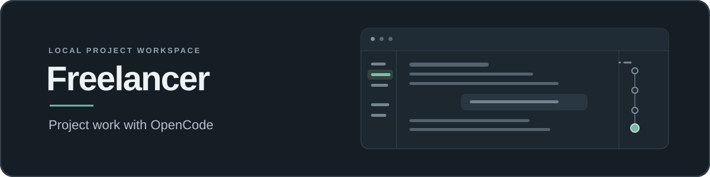

# Freelancer

Freelancer is a local workspace for AI-assisted project work. Open a folder, chat about the work, and review the files, tool activity, questions, checks and decisions alongside it.

It runs on your Windows computer in a browser or Chrome app window. [OpenCode](https://opencode.ai/) provides native conversations, models, authentication, tools, permissions, todos and child sessions. Freelancer adds project navigation, reusable named agents, specialist workers, local file and conversation search, history, usage views, appearance controls, optional Git/GitHub and recovery when work is interrupted.



## Quick start (Windows)

1. Download the source ZIP from [the Freelancer repository](https://github.com/Echomatter/Freelancer) and extract it, or clone `https://github.com/Echomatter/Freelancer.git` with Git. Open **PowerShell** in the resulting folder.
2. Run the setup:

   ```powershell
   powershell.exe -NoProfile -ExecutionPolicy Bypass -File scripts/install.ps1
   ```

3. When setup finishes, Freelancer opens in a Chrome app window. The installer also creates desktop shortcuts for starting and restarting it.
4. Add a project folder, connect a model provider under **Application settings → Providers**, and start a chat. A useful first request is: “Look through this project and explain how to run it.”

Setup installs or checks Node.js, Git, GitHub CLI and OpenCode, plus Chrome for the desktop shortcuts, then builds and starts the app. You still sign in to model providers through their supported authentication flow. For a browser-only setup without desktop shortcuts, add `-NoShortcuts -NoLaunch` to the setup command. See [Getting started](docs/getting-started.md) for prerequisites, manual installation and troubleshooting.

## What Freelancer includes

Freelancer keeps project work and the activity behind it in one local application.

- **Work on a folder:** Ask questions about your project, request changes, attach context and return to past chats.
- **Choose how to work:** Pick a named agent, such as Engineer for implementation or Researcher for investigation. Work runs in the fixed Build mode: an implementation request is implemented and verified, while a request for a plan is answered with a plan.
- **Get another perspective:** Ask the assistant to give a focused task to another model, such as researching an issue or reviewing a change. Follow its progress and inspect its conversation.
- **Stay in control:** Review questions and permission requests, see task progress, and decide when to save or share changes. GitHub is optional; connecting an account does not automatically upload your project.
- **Make the space yours:** Adjust the layout and appearance, browse available models, and search project files and conversations.
- **Continue from another device:** Enable private-network access or optional internet access in Application settings, pair the browser once, and manage remembered devices. The private-network port and selected HTTPS port remain configured across restarts. Private-network access uses unencrypted HTTP; internet access uses Tailscale Funnel over HTTPS and still requires device pairing.

### Project workspace and chat

Each project is a folder you choose. Its chats stay grouped with that project, and Freelancer remembers the working context around them.

- **Persistent project navigation** keeps projects, chats and recent work accessible. Use the top-bar navigation control to collapse it on desktop or hide it on a phone; swipe right from the phone screen’s left edge to restore it. Project indexing can continue in the background while you enter the workspace.
- **Attachments and saved drafts** let you prepare a request before sending it. Draft revisions are saved locally and protected against stale-window overwrites and lost acknowledgements.
- **Immediate send feedback** shows a submitted request while chat creation or native dispatch is still completing, without pretending that transport acceptance means the work has finished.
- **Queued follow-ups** can wait for a safe boundary instead of colliding with active work.
- **Project goals** keep a named objective in one chat. Create or edit one in **Project settings → Goals**, then Start when ready. The compact goal header can be hidden without stopping work; [the goal guide](docs/goals.md) covers Resume, Stop and settings.
- **Questions and permission requests** remain explicit decisions. They are not hidden inside model prose.
- **Request groups** keep the answer, tool activity, tasks and delegated work associated with the instruction that caused them.
- **Details and Files panels** provide drill-down without forcing all execution noise into the transcript.
- **Task presentation** can be kept in the dock or shown inline, while completion, dismissal and cancellation remain separate actions.
- **Interruption and recovery** distinguish a confirmed failure from an uncertain delivery. Freelancer checks native state rather than blindly replaying work after a lost acknowledgement.

Closing the browser window does not stop the local server or work already running. If you used the desktop shortcut, use the tray icon's **Exit Freelancer** command to stop it. If you started the server with `npm.cmd start`, keep that PowerShell window open and press **Ctrl+C** to stop it.

### Turn navigation and context

The rail at the right edge of a chat combines turn navigation and scrolling beside the Details divider. Select a turn bubble to jump to its messages and show that turn's tool activity in the floating dock. Hover or focus a bubble for the recorded prompt, status, model and usage details. Drag the pulsing handle to scroll; drag the separate panel divider sideways to resize Details.

The rail color follows the selected palette and deepens with the latest reported model context usage. It does not estimate unsent text. **Project settings → Session defaults → Context window** controls OpenCode's native automatic compaction for that project's chats. The previous manual compact action is no longer in the chat menu.

The question-mark button below the context percentage explains the dots, scroll handle and context indicator. Open it with hover, keyboard focus or a tap; Escape closes it without changing your selected turn or draft.

### Agents and specialist workers

Named agents are reusable starting points for a request; they are not hidden permission systems.

**Agents** describe the perspective and working style you want. The built-in catalog includes Engineer, Researcher and Designer, and you can create your own. Agent settings include instructions, approach, response style, preferred model and reasoning variant. There is no separate workflow catalog to configure.

At the start of a chat you can choose an agent, parent model and supported reasoning variant. Project-level **Session defaults** define the starting agent, model and reasoning choices for new chats without rewriting existing conversations. Every request runs in the fixed Build mode with native todos kept in sync; a planning request is ordinary task text, not a separate execution mode.

A parent model can also hand a bounded assignment to a **worker**:

- ordinary eligible delegation can start in one call;
- each worker gets its own native child conversation;
- workers can research, implement, inspect or review focused concerns;
- a follow-up can continue the same worker with the same agent, model and context;
- worker cards expose progress and let you open the underlying conversation;
- structured results can report findings, evidence, changed files, checks, assumptions, risks, questions and next steps;
- the runtime verifies observed model/agent identity instead of trusting a worker's prose;
- child claims such as “tests passed” remain claims until the parent or runtime evidence validates them.

**Project settings → Delegation** controls project-specific worker behavior and limits. Concurrency and depth ceilings bound orchestration, but they do not create filesystem isolation. Concurrent writers should have disjoint scope; overlapping edits need deliberate sequencing. Freelancer does not silently replace the parent model or escalate to a paid model.

See [Architecture](docs/ARCHITECTURE.md) for the separation between guidance, capability, authority, scheduling and routing.

### Models, providers and available usage

Freelancer exposes the model layer instead of hiding it behind one generic selector.

**Application settings → Models** provides a browsable model catalog with provider, availability and model information. You can search and sort the catalog, filter to free models, inspect models by provider, and use the catalog when configuring agents. Model-rating jobs can collect dated comparative information without turning those ratings into automatic routing policy.

**Application settings → Providers** currently supports setup for OpenAI, GitHub Copilot, OpenCode Go and OpenCode Free. Depending on the provider, you can:

- connect or reconnect supported authentication;
- describe the plan as a monthly subscription or pay-as-you-go;
- record a subscription price for usage calculations;
- choose the display currency;
- assign a provider color used consistently throughout the interface.

Credentials remain with the native/provider authentication systems; Freelancer does not copy them into its own database.

**Application settings → Available Usage** turns provider/model telemetry into a practical view of remaining availability. It is designed around usable capacity rather than presenting token or dollar estimates as if they were provider billing records. Unknown, estimated and unavailable information stays distinguishable.

**Application settings → Capabilities** shows tools, skills and shared MCP connections. Use each card’s help bubble for status explanations and technical details. Manage agent definitions under **Application settings → Agents**. File access is under **Application settings → File access**. See [Capabilities](docs/capabilities.md) and [File access scope](docs/file-access.md).

The workspace model picker can optionally hide exhausted models. That preference lives under **Available Usage → Model visibility** and retains its saved value from Appearance.

### Appearance and layout

Appearance is a first-class part of the application rather than a light/dark toggle.

Freelancer currently ships with **300 named palettes: 150 light and 150 dark**. Palettes use shared semantic tokens so the workspace, navigation, panels, controls and text change together instead of accumulating one-off colors. The catalog includes perceptual-separation checks in addition to contrast and CSS contract tests.

Under **Application settings → Appearance** you can:

- browse the light and dark palette collections visually;
- apply a palette to the whole application;
- generate, name and save custom themes from the palette generator at the top.

The generator and theme collections start collapsed. Each has its own labeled disclosure control, and the current theme stays visible above them.

Provider colors are configured separately on **Providers**. They give OpenAI, Copilot, OpenCode Go and OpenCode Free a recognizable visual identity where provider context is useful, while status/error colors keep their semantic meaning.

Workspace layout is also adjustable. Resizable panels, the Details panel, Files panel, sticky composer, task/delivery presentation and reduced-motion behavior are designed to remain usable across different window sizes. Appearance and layout preferences persist locally.

### Files, local search and project knowledge

**Project settings → Files** gives the selected project a file-oriented workspace view. **Project settings → Search project content** searches indexed files and conversations only in that project. **Application settings → Search all content** searches the same content across every registered project. Results open either the source file in Files or the matching conversation.

Freelancer also maintains a local content index so project knowledge can be searched without making the model rediscover every file for every question. The index covers readable source, configuration and document content throughout registered project roots while skipping generated/private areas and unsupported binary formats.

**Application settings → Content & Storage** lets you inspect and maintain that derived data. You can refresh project-file indexes, refresh the searchable conversation index, optimize full-text indexes, run a SQLite quick check, and compact free database pages.

The conversation index covers registered projects and can search titles plus user/assistant text, including archived chats and workers. It does not replace OpenCode as conversation authority and does not copy tool output, reasoning, attachments or drafts into the search index.

### History, imports and local data

**Search all content** finds files and conversations across projects and lets you pin chats. Its **Manage chats** action provides archive, restore, and export; **Archive, pin or export…** in a chat and **Export conversations** in Content & Storage open that same management area.

It supports:

- Active, Archived and All views;
- pinning;
- multi-selection;
- reversible local hiding/archiving where the native API does not provide a reversible archive contract;
- Undo for supported organization actions;
- progressive loading of larger histories;
- selected-conversation export.

New-project setup can optionally perform a **one-time ChatGPT / Codex import** before indexing. Imported snapshots remain separate from OpenCode's native database, use the shared transcript view, and can orient a new native conversation without modifying the source history.

The same **Content & Storage** page shows where Freelancer and OpenCode data live, provides backup guidance, and exposes project organization such as **Put project away** / **Restore project**. Putting a project away refreshes its search indexes, then hides it from active navigation; it does not delete the folder or rewrite its Git history. Global index refreshes skip put-away projects until you restore them.

Freelancer's organization/search database is normally stored in `%LOCALAPPDATA%\Freelancer\freelancer.sqlite`. Project files stay in their original folders. OpenCode continues to own its native conversations and provider sign-ins. See [Local data, history and archives](docs/local-data.md) for the exact ownership and backup model.

### Git and GitHub without making Git mandatory

GitHub is optional. A project can use Freelancer without being connected to GitHub, and connecting an account does not automatically upload a project.

**Project settings → GitHub** separates local history from online publication:

1. **Local project history** can initialize or adopt Git, set the checkpoint identity, and create reviewed local checkpoints.
2. **GitHub connection** uses GitHub CLI/browser authentication and keeps credentials in the system credential store.
3. A project can then be linked to an existing or new GitHub repository when you choose.
4. Upload/sync actions use explicit previews and confirmation.

Managed Git operations protect unrelated staged work, reject unsupported/conflicted selections, check common credential/private-file patterns, avoid force push, verify remote state, and record uncertain operations rather than replaying them blindly. Checkpoint means local history; connection means an account/repository relationship; neither means upload.

The GitHub panel keeps its heading and close control available while loading. A failed refresh preserves the last loaded status and unsaved form values, marks that status as stale, and requires a successful refresh before another Git action. Closing the panel or a read reaching its deadline does not stop native work or replay an action.

Set the Git agreement separately in **Project settings → GitHub** for each project. Application-wide Git defaults are retired; saved project agreements are preserved. If you explicitly request an operation outside that agreement, Freelancer can show an operation-specific preview and ask for native confirmation. Confirming a one-time request does not change the saved agreement.

See [Git and GitHub projects](docs/github-projects.md) for safeguards and boundaries.

## Settings map

Freelancer deliberately separates project-specific choices from application-wide preferences.

| Area | Setting | What it controls |
| --- | --- | --- |
| **Project** | **Files** | File-oriented view for the selected project |
|  | **Search project content** | Indexed files and conversations in the selected project |
|  | **Agents** | Built-in/custom working roles, instructions, model and response preferences |
|  | **GitHub** | Local Git history, GitHub authentication/linking, checkpoints and reviewed sync |
|  | **Session defaults** | Starting agent, model and reasoning choices for new chats in this project |
|  | **Goals** | Named objectives, linked goal chats, execution settings, Start, Resume and Stop |
|  | **Delegation** | Project worker/delegation behavior and orchestration limits |
| **Application** | **Models** | Searchable model catalog, provider/model information and rating activity |
|  | **Search all content** | Indexed files and conversations across registered projects |
|  | **Available Usage** | Remaining provider/model availability, usage observations and exhausted-model visibility |
|  | **Providers** | Authentication, plan type, optional subscription cost, currency and provider colors |
|  | **Appearance** | Palette generator, saved custom themes and 300 built-in palettes |
|  | **Capabilities** | Shared MCP connections and authentication; honest tool/skill status and read-only instruction sources |
|  | **Content & Storage** | Data locations, backup guidance, project archive/restore, index refresh and SQLite maintenance |
|  | **Remote access** | Remembered-device access on a private network or through an optional HTTPS tunnel |

Settings are intentionally layered: changing an agent definition, theme or project default affects future behavior or presentation; it does not rewrite historical request receipts or native conversations.

## How the pieces fit together

A normal implementation request can stay simple:

1. Open a project and chat.
2. Choose an agent/model, or keep the defaults.
3. Ask for the change.
4. The parent model uses native OpenCode tools and permissions.
5. If useful, it delegates a bounded concern to a specialist worker.
6. Follow tasks, tool activity, questions and worker progress in the workspace.
7. Review the result and changed files.
8. Save a local Git checkpoint or sync to GitHub only if you choose.

The machinery is there to make more complicated work inspectable; it is not a ceremony required for every request.

## Local-first boundaries

Freelancer is a local application, but “local” does not mean inference never leaves the computer. Project files and Freelancer's own state stay on the machine unless you explicitly publish files, while prompts and relevant context are sent to the model providers you choose.

A few boundaries are deliberate:

- Freelancer does not copy provider credentials into its database.
- It does not edit OpenCode's native conversation database directly.
- Workers share the selected project folder; there is no automatic worktree or filesystem sandbox.
- Usage figures are observations/estimates, not provider invoices.
- Search indexes are derived local data and can be rebuilt.
- GitHub publication requires explicit setup and reviewed actions.
- Automated fixtures and startup smoke tests do not prove that a user's provider authentication or live inference works.

## Handbook

The README is the product overview. The handbook goes deeper:

- [Getting started](docs/getting-started.md)
- [Architecture](docs/ARCHITECTURE.md)
- [Handbook index](docs/README.md)
- [Local data, history and archives](docs/local-data.md)
- [Git and GitHub projects](docs/github-projects.md)
- [State-aware sender](docs/state-aware-sender.md)
- [Project goals](docs/goals.md)
- [Conversation rail](docs/conversation-rail.md)
- [Release acceptance](docs/release-acceptance.md)

## For contributors and technical readers

This is a source-run React interface served by a local Node.js server. Native OpenCode handles conversations, inference, authentication, tools and permissions. Freelancer adds the project UI, saved organization, search, worker coordination, usage presentation, managed Git actions and optional remote access. Remote access uses one-time QR pairing and per-device remembered credentials, stored as hashes in private local state. Private-network traffic uses plain HTTP. Optional internet access uses Tailscale Funnel over HTTPS and only forwards to a loopback listener that requires a paired device for API access. There is no hosted Freelancer service or packaged installer. The [architecture guide](docs/ARCHITECTURE.md) maps ownership and source entry points; [repository instructions](AGENTS.md) cover changes to this codebase.

For phone or tablet access, open **Application settings → Remote access**. Choose the private network or HTTPS connection, pair each browser with a one-time QR code and remove devices individually when needed. See the [remote access guide](docs/network-access.md) for setup and the security boundary.

To run an already installed checkout manually, use Node.js **24.10 or newer** and the native OpenCode executable (`opencode-ai@1.18.31` is the [documented baseline](docs/getting-started.md#prerequisites)):

```powershell
npm.cmd ci
npm.cmd run build
npm.cmd start
```

Open the local URL printed by the server. For frontend development, see [development setup](docs/getting-started.md#development-and-checks). Useful checks are:

```powershell
npm.cmd run test:fast
npm.cmd run test:git
npm.cmd run build
```

The full suite is `npm.cmd test`; after a build, `npm.cmd run test:browser` exercises browser journeys with simulated services. `npm.cmd run smoke:runtime` checks installed OpenCode startup without making a model request. Tests do not establish that your own provider sign-in or model inference works.

[Repository instructions](AGENTS.md) cover changes to this codebase.

## Interface help

<!-- help:turn-rail -->
### Conversation rail

Each dot is a turn. Select one to jump to its messages and open its tools in the floating dock. Hover or focus a dot for recorded turn statistics. Arrow keys move between dots; Enter selects one. Regular transcript scrolling keeps your chosen tools in view.

Drag the pulsing ring to scroll. Its outer edge stays grabbable when it crosses a turn dot. With Details open, drag the separate divider at the panel edge left or right to resize it; double-click resets its width. Escape cancels a drag. The scroll handle also supports arrow keys, Page Up, Page Down, Home and End.

The rail becomes more saturated as the last reported model call fills its context window. The percentage includes cached input and output; it is not a live estimate of unsent text or a sum of the whole chat. A dash means usage or the model limit is unavailable. Automatic compaction is in Project settings, Session defaults, Context window.
<!-- /help -->

<!-- help:context-compaction -->
### Automatic context compaction

OpenCode can automatically summarize older context when the model's window fills. This setting applies to chats in this project, including existing chats. Earlier messages stay in conversation history. OpenCode owns the summary, timing and tool-output pruning; Freelancer only configures its native automatic compaction option.

Save while this project's chats and pending decisions are idle so OpenCode can refresh the setting without interrupting work. The preference is kept in Freelancer's local settings and restored after a server restart. Other native compaction options are preserved.
<!-- /help -->

Each card gathers its help into one small question-mark bubble at the lower
right. Related field topics share a topic selector. Page help sits in the lower-right
corner; headings stay clear, and the conversation rail has help below its context
percentage. Bubbles show these excerpts on hover, keyboard focus, or tap. Press
Escape or tap elsewhere to close one. The application reads the marked sections
from this README at build time; edit the documentation here to update the in-app
guidance. Page titles and menus stay concise. Errors, progress and action
confirmations remain visible.

<!-- help:schedules -->
### Scheduled prompts

Schedules start a fresh project chat at the chosen time. Keep the computer awake and the local server running; the browser can be closed. Choose a project, prompt, agent and model for each schedule.
<!-- /help -->

<!-- help:agents -->
### Named agents

An agent is a reusable specialist with its own working instructions and optional model preference. Pick the agent that best fits the request; task direction and constraints belong in the request itself. Agent instructions guide the work but do not grant permissions.
<!-- /help -->

<!-- help:providers -->
### Providers

Connect or reconnect a provider through its supported sign-in flow. Billing estimates, provider colors and availability are display preferences; they do not change native authentication, model permissions or usage limits.
<!-- /help -->

<!-- help:project-files -->
### Project files

Browse the selected project's files and folders. The browser stays within the registered project directory; opening a file shows a local preview without changing the file.
<!-- /help -->

<!-- help:schedule-timing -->
### Schedule timing

The first run uses your browser's local timezone. Daily and weekly repeats use elapsed intervals of 24 hours and 7 days, so the local hour can shift with daylight saving. Missed runs are skipped, and a schedule does not overlap its previous active chat.
<!-- /help -->

<!-- help:schedule-execution -->
### Scheduled run behavior

Each run uses the selected model and the current agent instructions. Normal provider usage and native approvals apply. Open the run to answer requests. Pausing or deleting a schedule keeps existing chats and does not stop work already started. Uncertain delivery pauses the schedule for inspection rather than retrying it.
<!-- /help -->

<!-- help:file-search -->
### Search indexed content

Search project content looks for your words in indexed files and conversations for the selected project. Search all content uses the same search across every registered project, including archived content. File results open the original in Project settings → Files; conversation results open the parent conversation. Refresh indexes in Content & Storage to include older or recent changes. Generated folders, credentials, tool output, reasoning, attachments, drafts and unsupported binary files are excluded.
<!-- /help -->

<!-- help:index-coverage -->
### Index coverage

File refresh covers readable source, document, data and configuration files throughout active registered project roots. Putting a project away refreshes its indexes first; global refreshes then skip it until restored. Conversation refresh covers native chats and workers, including archived sessions. Search both through Search project content or Search all content. Project folders and OpenCode conversations remain the originals.
<!-- /help -->

<!-- help:index-maintenance -->
### Database maintenance

Freelancer's SQLite database holds organization, drafts and derived file and conversation search text. Maintenance acts on this database only. It does not edit OpenCode's native database or your project files. Free pages are reusable space inside the database; the write-ahead log holds pending database writes.
<!-- /help -->

<!-- help:index-reset -->
### Rebuild search indexes

Start clean discards the local file and conversation search copies and rebuilds them. Project files, OpenCode conversations, settings and drafts stay in place. Results can be incomplete while rebuilding.
<!-- /help -->

<!-- help:index-optimize -->
### Optimize search

Optimize refreshes SQLite query plans and compacts the file and conversation full-text indexes. It does not refresh the source content; use the index refresh actions for that.
<!-- /help -->

<!-- help:index-check -->
### Check database

Check runs SQLite's quick integrity check and reports any problems. It checks database structure, not whether indexed files and conversations are up to date.
<!-- /help -->

<!-- help:index-compact -->
### Compact database

Compact reclaims unused database pages. It needs temporary disk space and can briefly pause local database work. It does not delete projects or chats.
<!-- /help -->

<!-- help:local-data -->
### Local data ownership

Project files stay in the folders you chose. Freelancer stores organization, drafts, request records and rebuildable search copies locally. OpenCode owns native conversations, tools, execution and provider sign-in. Agents are reusable definitions; workers are running assignments linked to their parent chats.
<!-- /help -->

<!-- help:local-backup -->
### Local backups

Stop Freelancer's server and OpenCode before copying live databases. Copy each project folder and the available data locations, keeping SQLite sidecar files with their database. Conversation exports are readable snapshots, not a complete backup or an import format. Credentials and attachments outside those locations need separate backup arrangements.
<!-- /help -->

<!-- help:storage-freelancer -->
### Freelancer database

This database contains organization, drafts and derived project and conversation search text. Freelancer does not encrypt it; local protection relies on your user profile permissions. The displayed size covers the main database file only. Content & Storage contains refresh and maintenance controls.
<!-- /help -->

<!-- help:storage-runtime -->
### Runtime records

Existing JSON settings, request receipts, usage and sender records remain in the runtime data folder. A draft is editable unsent text; a queued message is an explicit delivery commitment. Archiving a project or conversation does not silently cancel queued work.
<!-- /help -->

<!-- help:storage-opencode -->
### OpenCode storage

OpenCode owns its native conversations and provider sign-in. This location is shared engine storage, not the size of the selected project. Freelancer accesses conversations through OpenCode and does not directly edit its database.
<!-- /help -->

<!-- help:project-archive -->
### Project archives

Putting a project away hides it from active navigation. Its folder, Git agreement and conversations stay in place. Restore it to bring it back. Archive and export organize or copy data; neither reclaims disk space or stops active work.
<!-- /help -->

<!-- help:history-search -->
### Managing chats

Search content → Manage chats lists the loaded OpenCode window, imported snapshots and previously seen references for one selected project. It manages pins, archive state and exports; cached entries are checked when opened. Use Search project content or Search all content to search indexed conversation titles, user/assistant text, project documents and source files. Refresh older content in Application settings → Content & Storage.
<!-- /help -->

<!-- help:history-export -->
### Conversation exports

Export writes the selected conversations as JSON or Markdown, including potentially sensitive message and tool text. Include workers to add their linked conversations. Project files and external attachment bytes are excluded. Exports are readable copies; they are not a full system backup, and Freelancer does not currently import them.
<!-- /help -->

<!-- help:session-defaults -->
### Session defaults

These choices start new chats in the selected project. Existing chats keep their choices. An agent with a saved model supplies the parent model and supported reasoning variant.
<!-- /help -->

<!-- help:parent-model -->
### Parent model

Choose the model for the main conversation. An agent's saved model takes precedence over the project's fallback for new chats. If the agent has no model, the session default supplies it. Intelligence lists the reasoning variants supported by that model.
<!-- /help -->

<!-- help:delegation -->
### Delegation budget

The main agent can work directly or assign bounded work to named agents. These settings control available resources and worker limits. Agent choices guide the work; they do not grant permissions or narrow the eligible model pool by themselves.
<!-- /help -->

<!-- help:delegation-scope -->
### Delegation scope

Project defaults apply to chats without their own override. A chat with saved limits keeps them. Select that chat and choose Selected chat to edit its budget.
<!-- /help -->

<!-- help:worker-models -->
### Worker models

The cost preference selects eligible worker capacity. Paid subscription workers still use OpenCode's native permission. API-metered models are excluded from this delegation path; selecting a preference does not authorize spending.
<!-- /help -->

<!-- help:delegation-limits -->
### Worker limits

The parallel limit is a ceiling, not a team-size target. Depth limits how far workers can delegate. Existing model allowlists, exclusions, context policy and child timeout remain in effect until explicitly changed. Workers share the project folder.
<!-- /help -->

<!-- help:delegation-changes -->
### Saving delegation settings

Saved changes govern the next main request. Active assignments retain their captured budget; tighter limits can block later dispatches but do not silently cancel running work. Native permissions and project agreements remain in effect.
<!-- /help -->


<!-- help:git-history -->
### Local history

Checkpoints save Git history on this computer. Turning on tracking can adopt existing history or initialize the selected folder. Stopping tracking automation keeps existing history and files. Use Edit to change your project identity. Checkpoints are uploaded only through a separate Cloud sync action.
<!-- /help -->

<!-- help:git-main -->
### Main version

Select the existing branch that the agreement should treat as the main version. This affects future work; saving the choice does not rename or switch a branch.
<!-- /help -->

<!-- help:git-identity -->
### Checkpoint identity

Choose Edit on Local history to change the name and email under Make changes as. They appear in future Git history. They are saved in this project's Git configuration only. Use your own identity and your preferred public or GitHub private email before creating history.
<!-- /help -->

<!-- help:git-connection -->
### Cloud sync

Account sign-in and linking a project to a repository are separate steps. Sign in through the browser; credentials stay in the system credential store. Turn on local history before linking a repository. Connecting or creating a private repository does not upload files.
<!-- /help -->

<!-- help:git-agreement -->
### Git working agreement

The saved agreement controls managed Git actions. Agent instructions do not grant additional authority. Turning sync off keeps existing files and history. Inspect only prevents managed mutations; the other styles determine how checkpoints and reviewed uploads are handled.
<!-- /help -->

<!-- help:git-explicit-request -->
### Explicit Git requests

You can explicitly request a different Git action in chat and confirm it there. A one-time request leaves the saved defaults unchanged. Native permissions and the action's safety checks still apply.
<!-- /help -->

<!-- help:git-sync -->
### Checkpoints and sync

Each preview names the selected files and destination. Sync checks outgoing history for common credential patterns and Git errors; it does not run the project's test suite. Excluded files, conflicts, staged renames and unsupported histories need attention before continuing. No file changes does not mean all existing checkpoints have been uploaded.
<!-- /help -->

<!-- help:git-first-upload -->
### First upload

Upload starting version publishes the starting checkpoint before preparing task reviews. It is available only while the linked GitHub repository is empty. Review the preview's destination and files before approving.
<!-- /help -->

<!-- help:git-receipts -->
### Git action history

Local checkpoints and completed uploads are separate records. A preview has not run yet. Use the operation result and destination to check what completed; a local checkpoint alone is not proof of upload.
<!-- /help -->

<!-- help:theme -->
### Themes

Choose a palette to apply it across the application. Light and dark groups are ordered by accent color. Provider colors are configured separately in Providers; status colors retain their meaning.

The Palette generator at the top lets you roll a fresh palette. Choose Surprise me, Light, or Dark and click Regenerate until you find one you like. The preview stays unsaved until you choose Save & use. A name is optional. Generated colors pass readability checks and differ from the built-in and saved collections. Saved choices appear in Custom themes and remain available after restarting Freelancer. All groups start collapsed; expand their labeled controls to browse or create.
<!-- /help -->

<!-- help:provider-color -->
### Provider colors

A provider's color follows it and its models throughout the app. Text shades adjust to the current palette for readability. Preview a preset or custom hex color, then save it or restore the default.
<!-- /help -->

<!-- help:usage-estimate -->
### Usage estimate

Each connected finite plan contributes an equal share to the combined estimate. The fill shows remaining availability, not interchangeable capacity or provider billing. Free models sit outside this estimate. Unknown portions are not empty, and one window resetting may not restore access while another limit remains.
<!-- /help -->

<!-- help:contributions -->
### Activity shares

Shares summarize observed activity by model or agent. They are estimates, not quality scores or subscription usage. Missing observations and unresolved delegation links make the breakdown partial. Monthly activity covers the current month.
<!-- /help -->

<!-- help:project-import -->
### Importing conversations

The optional one-time import copies local user/assistant messages and recorded tool output before indexing. Credentials, hidden reasoning, system instructions and external attachment files are excluded. Continuing an imported chat uses its history to orient a new native conversation. The original app and database stay unchanged.
<!-- /help -->

<!-- help:project-indexes -->
### Project preparation

Project preparation builds searchable copies of project files and past conversations. Existing indexes are reused after the first successful setup. Stop indexing to end that setup job without deleting the original files or conversations.
<!-- /help -->

<!-- help:project-name -->
### Project display name

Renaming changes the name shown in Freelancer. The project folder and native workspace remain where they are.
<!-- /help -->

<!-- help:message-options -->
### Message options

Message settings apply to the next message. Attach files with the file chooser or drop them into the composer. Existing messages keep their captured settings.
<!-- /help -->

<!-- help:message-delivery -->
### Messages during a response

Delegate asks the current parent to assign an additional concern to a worker. Steer asks it to adjust its own ongoing work. Both deliver at the next supported boundary without aborting; tools already executing may finish first. Queue sends after the current turn and stays intact when steering. Stop remains available for cancellation. A model override applies to the queued parent turn or Delegate's worker, never to the running parent on Steer. Pending cards are editable before dispatch. Saved delivery, model-input inclusion and observed action are distinct; inspect uncertain outcomes before retrying. Attached files stay in the composer.
<!-- /help -->

<!-- help:model-ratings -->
### Model rating updates

The selected configuration model researches missing model details in the background using its normal provider allowance. Ratings are dated comparison guidance, not proof of availability or permission to use a model.
<!-- /help -->

<!-- help:remote-access -->
### Remote access

Use Freelancer from another device on the same private network or from a browser over the internet while this computer is running. Private-network access uses unencrypted HTTP. Internet access uses Tailscale Funnel over HTTPS; the app still requires each browser to be paired on this computer. Only the local desktop can manage remote access.
<!-- /help -->

<!-- help:remote-address -->
### Remote address

The saved private-network port stays fixed across restarts. The internet address uses the selected Tailscale HTTPS port; the local loopback port is renewed at startup. Reserve this computer's IP address in your router to keep its private-network address stable. If an address or port is unavailable, resolve the reported connection error rather than expecting a different public port.
<!-- /help -->

<!-- help:remote-pairing -->
### Pairing a device

Scan a one-time QR code from the selected private-network or HTTPS address, name your device and choose Remember this device. The code expires after five minutes. Reopen the saved address after restarting Freelancer; the browser remains paired until its credential expires or is removed. Web credentials use a Secure cookie and server-side hashes.
<!-- /help -->

<!-- help:remote-devices -->
### Remembered devices

Each browser has its own credential and expiry. Removing a device disconnects it immediately and requires a new pairing code. Remember new devices for controls the lifetime of newly paired credentials.
<!-- /help -->

<!-- help:remote-web -->
### Internet access

Freelancer uses Tailscale Funnel to provide an HTTPS address without opening a router port. The address is reachable from the internet, but API requests remain blocked until that browser is paired here. The web listener is bound to loopback and API access always requires a remembered-device credential. Disable access here to close the listener and remove Freelancer's Funnel route. Other services on occupied ports are left alone.
<!-- /help -->

<!-- help:capability-tools -->
### Tools

Loaded means OpenCode provides this tool. Its use still depends on the model and native permissions; the label does not claim a successful call. Available means the current inspection also confirmed model support, permission and dependencies. Needs permission means OpenCode will ask before use. Restricted and Unavailable indicate a permission or dependency limit. Unknown means inspection could not confirm the state.

Tools are shared across agents and projects. Refresh checks the current runtime. The technical details below include tool origins, inspection errors and captured instruction sources; these are read-only and are not the complete provider prompt.
<!-- /help -->

<!-- help:capability-skills -->
### Skills

Skills provide instructions that agents can load when useful. Found means OpenCode discovered the skill; it does not prove that its dependencies are installed. Missing file and Not found report missing instructions. Unknown means inspection could not confirm the state. Technical file locations and dependency details appear below.
<!-- /help -->

<!-- help:mcp-connections -->
### MCP connections

MCP connects additional services to the shared toolkit. Connections apply to every agent and project. OpenCode manages configuration and sign-in. Connected reports the connection state; model support and native permission still determine whether a tool can be used.

Add a remote service URL or a local command, approve the connection, then sign in when required. Local commands run on this computer. Test / retry checks a connection. Disable keeps its saved configuration. Use native {env:VARIABLE_NAME} references for secrets in headers or environment fields. Configuration is saved by OpenCode.
<!-- /help -->

<!-- help:file-access -->
### File access

This shared setting chooses which locations agents can read, search and edit: the current project folder, all registered project folders, or files on this computer. It applies to every agent and model. Native permissions and explicit denials still apply; private Git and application state remain protected.

The choice covers known file and search tools. Shell commands and connected services can have other filesystem effects, so this is not a computer-wide sandbox. It does not change indexing or data storage.
<!-- /help -->
