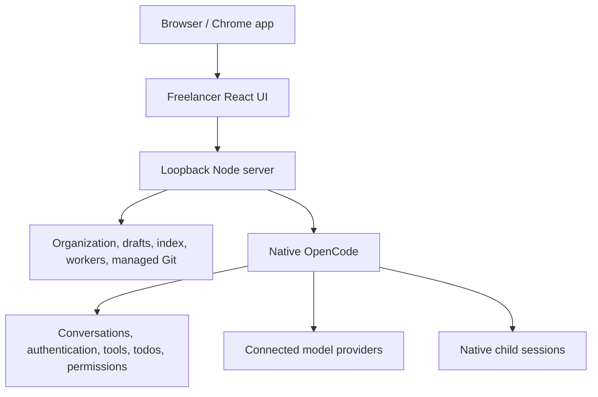

# Freelancer architecture

[Overview](../README.md) · [Setup](getting-started.md) · [Handbook](README.md)

Freelancer for OpenCode is one Windows-oriented source-run application: React in a browser or Chrome app, a loopback Node server, and native OpenCode. Closing the browser does not stop the independent server or cancel work.

## Ownership

OpenCode owns conversations, inference, authentication, native tools, permissions, todos and child sessions. Freelancer uses native APIs and never edits native persistence or copies credentials. Project means the selected source folder; Chat means the main native conversation; Worker means an assignment, not an agent definition.

## Five separate concerns

**Guidance:** `domain/workspace.mjs` plus saved settings owns the Agent and Workflow catalog. Skills add operating knowledge. `server/execution.mjs` composes captured instructions for roots and children. Native profiles carry identity and permissions, not a duplicate persona store. Edits affect future root requests.

**Capability:** native tools, connected MCP tools, content_index, delegate and git_project are available where actual permissions allow. Skills are not capability keys. Simple work needs no workers.

**Authority:** native permission, explicit user constraints, paid-model consent and the saved project agreement. Explicit inspection-only assignments narrow children; workflow names do not. Authenticated native identity and durable records establish authority, never model-provided metadata or editable prose.

**Scheduling:** shared concurrency and depth ceilings, native liveness, idempotent assignments and uncertain-delivery safeguards. Concurrent writers should use disjoint scope; overlapping edits need sequencing. There is no filesystem sandbox or automatic worktree isolation.

**Routing:** one backend uses connected inventory, explicit models, free-only constraints, capability evidence, context, quotas and exclusions. Parent models never change implicitly. Separately metered worker routes are unavailable. Unknown evidence and telemetry remain labeled uncertainty.

## Request and worker lifecycle

1. Choose a project, optionally a model, and ask for work. Agent, workflow and reasoning choices have usable defaults.
2. The server validates project/session ownership and native model availability, then captures catalog and resource limits in a private request receipt.
3. OpenCode executes with a compact catalog in context. `delegate({agent, task, workflow?, model?})` starts an ordinary free assignment in one call. Native paid_delegate consent handles subscription work without a preceding model-choice menu.
4. Each worker uses its own native session. SDK-observed model and agent identity must match dispatch. The tree shares depth and concurrency limits; native permissions and tighter saved restrictions are revalidated. Native task is disabled as a competing dispatch path.
5. A bounded `worker_result` carries summary and optional findings, evidence, changed files, checks, attempts, assumptions, risks, questions and next steps. `resultSource` distinguishes structured_completion, final_assistant_fallback and partial. Child checks remain unverified claims until the parent validates them. Full native conversations remain available.
6. `delegate({worker, task})` continues the same agent/model/context. Ownership, idle state, eligibility and permissions are rechecked. Busy or uncertain children cannot be silently restarted.

Runtime signals include tool calls, failed calls and equivalent failure counts. Three equivalent tool failures stop a worker for diagnosis. Three failed attempts at the same assignment in a root request block another unchanged attempt. No automatic premium escalation or model bouncing occurs. A capable parent can advise a worker and continue it with focused feedback.

Native child questions remain attached to their session; open the worker to answer and continue there. Waiting for input is distinct from active progress. Completion, abort acknowledgement and verified task success are separate evidence.

## Sender and UI

Queue schedules a parent request after completion and approvals. Delegate hands a bounded concern to the same parent at a safe boundary, asking it to use normal delegation. Transport acceptance does not prove a worker started. The internal sender kind `clarify` identifies that operation; it is not an execution engine. Draft snapshots, idempotency, cancellation, model scope and uncertain-delivery recovery stay server-owned. [Sender behavior](state-aware-sender.md)

The scroll area spans the workspace beside a sticky composer. Task and delivery cards collapse and dismiss without changing native todos or canceling work. Changed tasks/delivery states reappear. Explicit cancellation stays separate. Chat remains mounted across navigation; secondary pages load on demand. Short transitions honor reduced motion. Provider colors use shared contrast-adjusted tokens; status colors retain semantic meaning.

## Managed Git

Any capable agent can use git_project; Git/Sync is optional guidance. The service enforces agreements, exact previews, selected files, unrelated index protection, private-file/credential checks, approval, remote-tip verification and uncertain-operation recovery. No force push. Merge needs explicit intent and confirmation. Checkpoint is local; connection is not binding, and binding is not upload. [Git safeguards](github-projects.md)

## Data and startup

Private JSON lives in ignored `backend/.state/`. Organization, drafts, search and model ratings use `%LOCALAPPDATA%\Freelancer\freelancer.sqlite`, or absolute `FREELANCER_DATA_HOME`. Native data stays with OpenCode. Fresh source imports no old application history, registrations, drafts, receipts, databases or caches.

`FREELANCER_APP_ROOT` optionally overrides the source root; `FREELANCER_RUNTIME_ROOT` points plugins at its backend. `OPENCODE_CONFIG_DIR` / `OPENCODE_CONFIG` select local plugins and profiles. `XDG_CONFIG_HOME` isolates configuration. Native `XDG_DATA_HOME` remains the existing OpenCode location, preserving auth without copying it. `FREELANCER_WEB_PORT` optionally fixes the loopback port.

`server/main.mjs` owns startup and the lock. `scripts/launch-web.ps1` verifies root, process, lock and live page before reusing a server. The native launcher is Windows-specific. Local text is not encrypted by Freelancer. Provider inference sends relevant context externally.

## Code map and validation

| Concern | Entry points |
| --- | --- |
| UI/navigation | `src/App.tsx`, `src/Chat.tsx`, `src/ChatSender.tsx` |
| Catalog/instructions | `domain/workspace.mjs`, `server/execution.mjs` |
| Workers | `backend/tools/runtime/delegation.mjs`, `execution-context.mjs`, `worker-result.mjs` |
| Routing/budget | `shared/strategy.mjs`, `domain/delegation-policy.mjs`, `backend/scripts/select-model.ps1` |
| Native integration | `server/application.mjs`, `server/host.mjs` |
| Git | `server/git-project.mjs`, `domain/git-project.mjs` |
| Data | `server/data/`, `server/store.mjs`, `server/history.mjs` |
| Color | `domain/theme.mjs`, `domain/provider-colors.mjs`, `src/ProviderColors.tsx` |

Run `npm test`, `npm run build`, palette CSS check, then `npm run test:browser`. `npm run smoke:runtime` separately starts installed OpenCode without inference. Fixtures, browser rendering, native startup, real inference, authentication and visible Windows launch are distinct evidence boundaries.
